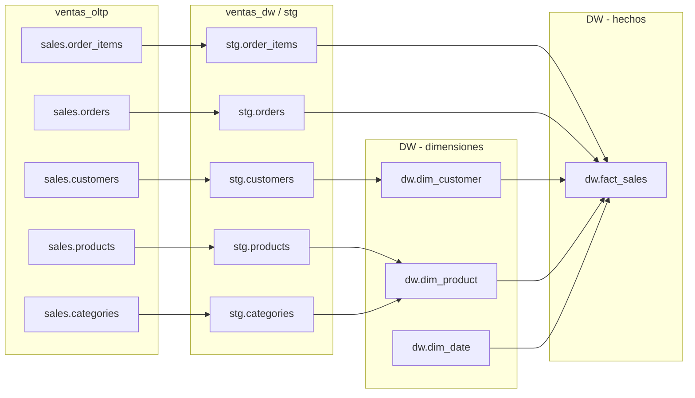

# Documentación del proyecto ADF

## Índice

1. [Introducción](#1-introducción)
2. [Diccionario de datos](#2-diccionario-de-datos)
3. [Matriz de dependencias](#3-matriz-de-dependencias)
4. [Diagrama de lineage](#4-diagrama-de-lineage)

---

## 1. Introducción

Este documento consolida la documentación técnica derivada de los scripts SQL y de los recursos exportados de Azure Data Factory.

El flujo documentado es:

- `ventas_oltp.sales.*` → `stg.*` (mediante el pipeline `PL_01_Stage` y la tabla de control `etl.copy_config`)
- `stg.*` → `dw.dim_*` / `dw.fact_sales` (mediante stored procedures)
- Orquestación de pipelines basada en los JSON disponibles

---

## 2. Diccionario de datos

### Base `ventas_oltp`

#### Esquema `sales`

##### `sales.categories`
- **Descripción:** Catálogo de categorías de productos.
- **Claves:**
  - PK: `category_id`
- **Columnas:**

| Columna | Tipo | Nulo | Clave | Descripción |
|---|---|---:|---|---|
| `category_id` | `INT` | No | PK | Identificador de la categoría. |
| `category_name` | `NVARCHAR(100)` | No |  | Nombre de la categoría. |
| `created_at` | `DATETIME2(0)` | No |  | Fecha de creación. |

##### `sales.products`
- **Descripción:** Catálogo de productos.
- **Claves:**
  - PK: `product_id`
  - FK: `category_id` → `sales.categories(category_id)`
- **Columnas:**

| Columna | Tipo | Nulo | Clave | Descripción |
|---|---|---:|---|---|
| `product_id` | `INT` | No | PK | Identificador del producto. |
| `product_name` | `NVARCHAR(200)` | No |  | Nombre del producto. |
| `category_id` | `INT` | No | FK | Referencia a la categoría. |
| `unit_price` | `DECIMAL(12,2)` | No |  | Precio unitario. |
| `is_active` | `BIT` | No |  | Indicador de actividad. |
| `created_at` | `DATETIME2(0)` | No |  | Fecha de creación. |

##### `sales.customers`
- **Descripción:** Clientes del negocio.
- **Claves:**
  - PK: `customer_id`
- **Columnas:**

| Columna | Tipo | Nulo | Clave | Descripción |
|---|---|---:|---|---|
| `customer_id` | `INT` | No | PK | Identificador del cliente. |
| `full_name` | `NVARCHAR(200)` | No |  | Nombre completo. |
| `email` | `NVARCHAR(200)` | Sí |  | Correo electrónico. |
| `city` | `NVARCHAR(100)` | Sí |  | Ciudad. |
| `country_code` | `CHAR(2)` | No |  | Código de país. |
| `created_at` | `DATETIME2(0)` | No |  | Fecha de creación. |

##### `sales.orders`
- **Descripción:** Cabeceras de pedidos.
- **Claves:**
  - PK: `order_id`
  - FK: `customer_id` → `sales.customers(customer_id)`
- **Columnas:**

| Columna | Tipo | Nulo | Clave | Descripción |
|---|---|---:|---|---|
| `order_id` | `INT` | No | PK | Identificador del pedido. |
| `customer_id` | `INT` | No | FK | Referencia al cliente. |
| `order_date` | `DATETIME2(0)` | No |  | Fecha del pedido. |
| `status` | `VARCHAR(20)` | No |  | Estado del pedido. |

##### `sales.order_items`
- **Descripción:** Líneas detalle de pedidos.
- **Claves:**
  - PK: `order_item_id`
  - FK: `order_id` → `sales.orders(order_id)`
  - FK: `product_id` → `sales.products(product_id)`
- **Columnas:**

| Columna | Tipo | Nulo | Clave | Descripción |
|---|---|---:|---|---|
| `order_item_id` | `INT` | No | PK | Identificador de la línea. |
| `order_id` | `INT` | No | FK | Referencia al pedido. |
| `product_id` | `INT` | No | FK | Referencia al producto. |
| `quantity` | `INT` | No |  | Cantidad. |
| `unit_price` | `DECIMAL(12,2)` | No |  | Precio unitario. |

### Base `ventas_dw`

#### Esquema `stg`

##### `stg.categories`
- **Descripción:** Copia cruda de `sales.categories`.
- **Columnas:**

| Columna | Tipo | Nulo | Clave | Descripción |
|---|---|---:|---|---|
| `category_id` | `INT` | Sí |  | Identificador desde origen. |
| `category_name` | `NVARCHAR(100)` | Sí |  | Nombre desde origen. |
| `created_at` | `DATETIME2(0)` | Sí |  | Fecha desde origen. |

##### `stg.products`
- **Descripción:** Copia cruda de `sales.products`.
- **Columnas:**

| Columna | Tipo | Nulo | Clave | Descripción |
|---|---|---:|---|---|
| `product_id` | `INT` | Sí |  | Identificador desde origen. |
| `product_name` | `NVARCHAR(200)` | Sí |  | Nombre desde origen. |
| `category_id` | `INT` | Sí |  | Referencia a categoría. |
| `unit_price` | `DECIMAL(12,2)` | Sí |  | Precio unitario. |
| `is_active` | `BIT` | Sí |  | Indicador de actividad. |
| `created_at` | `DATETIME2(0)` | Sí |  | Fecha desde origen. |

##### `stg.customers`
- **Descripción:** Copia cruda de `sales.customers`.
- **Columnas:**

| Columna | Tipo | Nulo | Clave | Descripción |
|---|---|---:|---|---|
| `customer_id` | `INT` | Sí |  | Identificador desde origen. |
| `full_name` | `NVARCHAR(200)` | Sí |  | Nombre completo. |
| `email` | `NVARCHAR(200)` | Sí |  | Correo electrónico. |
| `city` | `NVARCHAR(100)` | Sí |  | Ciudad. |
| `country_code` | `CHAR(2)` | Sí |  | Código de país. |
| `created_at` | `DATETIME2(0)` | Sí |  | Fecha desde origen. |

##### `stg.orders`
- **Descripción:** Copia cruda de `sales.orders`.
- **Columnas:**

| Columna | Tipo | Nulo | Clave | Descripción |
|---|---|---:|---|---|
| `order_id` | `INT` | Sí |  | Identificador desde origen. |
| `customer_id` | `INT` | Sí |  | Referencia al cliente. |
| `order_date` | `DATETIME2(0)` | Sí |  | Fecha del pedido. |
| `status` | `VARCHAR(20)` | Sí |  | Estado del pedido. |

##### `stg.order_items`
- **Descripción:** Copia cruda de `sales.order_items`.
- **Columnas:**

| Columna | Tipo | Nulo | Clave | Descripción |
|---|---|---:|---|---|
| `order_item_id` | `INT` | Sí |  | Identificador de la línea. |
| `order_id` | `INT` | Sí |  | Referencia al pedido. |
| `product_id` | `INT` | Sí |  | Referencia al producto. |
| `quantity` | `INT` | Sí |  | Cantidad. |
| `unit_price` | `DECIMAL(12,2)` | Sí |  | Precio unitario. |

#### Esquema `dw`

##### `dw.dim_date`
- **Descripción:** Dimensión temporal precargada.
- **Claves:**
  - PK: `date_sk`
- **Columnas:**

| Columna | Tipo | Nulo | Clave | Descripción |
|---|---|---:|---|---|
| `date_sk` | `INT` | No | PK | Clave temporal (`YYYYMMDD`). |
| `full_date` | `DATE` | No |  | Fecha completa. |
| `year` | `SMALLINT` | No |  | Año. |
| `quarter` | `TINYINT` | No |  | Trimestre. |
| `month` | `TINYINT` | No |  | Mes. |
| `month_name` | `NVARCHAR(20)` | No |  | Nombre del mes. |
| `day` | `TINYINT` | No |  | Día. |
| `day_of_week` | `TINYINT` | No |  | Día de la semana. |

##### `dw.dim_customer`
- **Descripción:** Dimensión tipo SCD1 de clientes.
- **Claves:**
  - PK: `customer_sk`
  - UK: `customer_id`
- **Columnas:**

| Columna | Tipo | Nulo | Clave | Descripción |
|---|---|---:|---|---|
| `customer_sk` | `INT` | No | PK | Surrogate key. |
| `customer_id` | `INT` | No | UK | ID de negocio. |
| `full_name` | `NVARCHAR(200)` | No |  | Nombre. |
| `city` | `NVARCHAR(100)` | Sí |  | Ciudad. |
| `country_code` | `CHAR(2)` | Sí |  | Código de país. |

##### `dw.dim_product`
- **Descripción:** Dimensión de productos con categoría denormalizada.
- **Claves:**
  - PK: `product_sk`
  - UK: `product_id`
- **Columnas:**

| Columna | Tipo | Nulo | Clave | Descripción |
|---|---|---:|---|---|
| `product_sk` | `INT` | No | PK | Surrogate key. |
| `product_id` | `INT` | No | UK | ID de negocio. |
| `product_name` | `NVARCHAR(200)` | No |  | Nombre del producto. |
| `category_name` | `NVARCHAR(100)` | Sí |  | Nombre de categoría. |
| `unit_price` | `DECIMAL(12,2)` | No |  | Precio unitario. |

##### `dw.fact_sales`
- **Descripción:** Tabla de hechos de ventas por línea.
- **Claves:**
  - PK: `sale_sk`
  - FK: `date_sk` → `dw.dim_date(date_sk)`
  - FK: `customer_sk` → `dw.dim_customer(customer_sk)`
  - FK: `product_sk` → `dw.dim_product(product_sk)`
- **Columnas:**

| Columna | Tipo | Nulo | Clave | Descripción |
|---|---|---:|---|---|
| `sale_sk` | `BIGINT` | No | PK | Surrogate key. |
| `date_sk` | `INT` | No | FK | Clave temporal. |
| `customer_sk` | `INT` | No | FK | Clave del cliente. |
| `product_sk` | `INT` | No | FK | Clave del producto. |
| `order_id` | `INT` | No |  | ID del pedido. |
| `quantity` | `INT` | No |  | Cantidad vendida. |
| `unit_price` | `DECIMAL(12,2)` | No |  | Precio unitario. |
| `line_total` | `DECIMAL(14,2)` | No |  | Total de la línea. |

---

## 3. Matriz de dependencias

### 3.1 Origen → staging

| Tabla origen | Tabla destino |
|---|---|
| `sales.categories` | `stg.categories` |
| `sales.products` | `stg.products` |
| `sales.customers` | `stg.customers` |
| `sales.orders` | `stg.orders` |
| `sales.order_items` | `stg.order_items` |

### 3.2 Staging → DW

| Tabla leída | Tabla escrita |
|---|---|
| `stg.customers` | `dw.dim_customer` |
| `stg.products`, `stg.categories` | `dw.dim_product` |
| `stg.order_items`, `stg.orders`, `dw.dim_customer`, `dw.dim_product`, `dw.dim_date` | `dw.fact_sales` |

### 3.3 Orquestación de pipeline

| Pipeline | Dependencia observada |
|---|---|
| `PL_01_Stage` | `Lookup` sobre `etl.copy_config` y `ForEach` para los copies dinámicos |
| `SP_Log_Start` | Se ejecuta al inicio |
| `SP_Log_Success` / `SP_Log_Failure` | Se ejecutan al final según el resultado |

---

## 4. Diagrama de lineage

